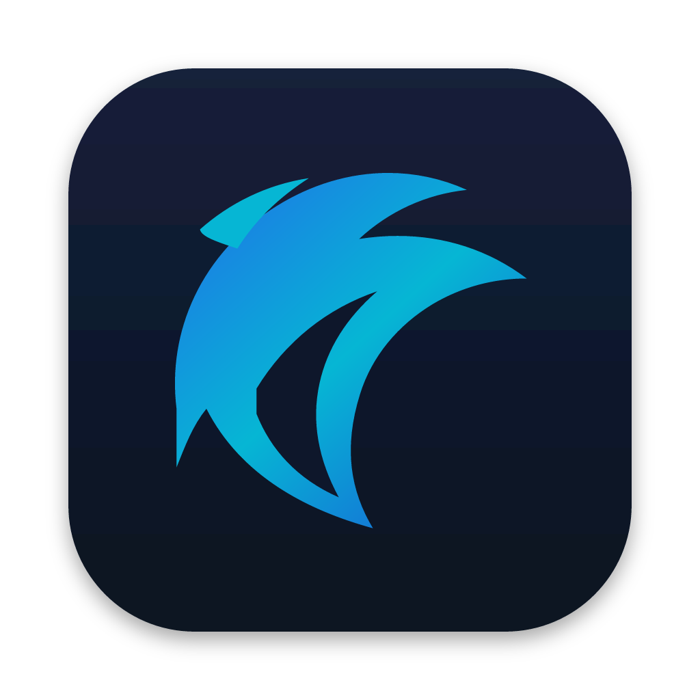

<h1 align="center">
  <a href="https://dolphin.guss.dev.br"></a> Dolphin
</h1>

<p align="center">
  <a href="https://github.com/GussCloud/dolphin"></a>
  <a href="https://github.com/GussCloud/dolphin/releases"></a>
  
  <a href="https://discord.gg/fzjDKHxv8Q"></a>
  <a href="https://x.com/dolphin_build"></a>
  
</p>

<p align="center">
  <sub><a href="docs/readme/README.zh-CN.md">中文</a> · <a href="docs/readme/README.ja.md">日本語</a> · <a href="docs/readme/README.ko.md">한국어</a> · <a href="docs/readme/README.es.md">Español</a> · <a href="docs/readme/README.fr.md">Français</a> · <a href="docs/readme/README.pt.md">Português</a></sub>
</p>

<p align="center">
  <strong>The AI Orchestrator for 100x builders.</strong><br/>
  Run Codex, ClaudeCode, OpenCode or Pi side-by-side — each in its own worktree, tracked in one place.
</p>

<h3 align="center"><a href="https://dolphin.guss.dev.br/download"><ins>Download Dolphin</ins></a></h3>

<p align="center">
  
</p>

## Features

<table>
<tr>
<td width="50%" valign="middle">

### Mobile Companion

Monitor and steer your agents from your phone — get notified when an agent finishes and send follow-ups from anywhere.

[iOS App Store](https://apps.apple.com/us/app/dolphin-ide/id6766130217) · [TestFlight](https://testflight.apple.com/join/YjeGMQBA) · [Android APK 0.0.50](https://github.com/GussCloud/dolphin/releases/download/mobile-android-v0.0.50/app-release.apk) · [Docs →](https://dolphin.guss.dev.br/docs/mobile)

</td>
<td width="50%">
  <a href="https://dolphin.guss.dev.br/docs/mobile"><picture><source srcset="docs/assets/feature-wall/mobile-companion-app-showcase.gif" type="image/gif"></picture></a>
</td>
</tr>
<tr>
<td width="50%" valign="middle">

### Parallel Worktrees

Fan one prompt across five agents, each in its own isolated git worktree — compare the results and merge the winner.

[Docs →](https://dolphin.guss.dev.br/docs/model/worktrees)

</td>
<td width="50%">
  <a href="https://dolphin.guss.dev.br/docs/model/worktrees"><picture><source srcset="docs/site/public/docs/tab-split.gif" type="image/gif"></picture></a>
</td>
</tr>
<tr>
<td width="50%" valign="middle">

### Terminal Splits

Ghostty-class terminals with WebGL rendering, infinite splits, and scrollback that survives restarts.

[Docs →](https://dolphin.guss.dev.br/docs/terminal)

</td>
<td width="50%">
  <a href="https://dolphin.guss.dev.br/docs/terminal"><picture><source srcset="resources/onboarding/feature-wall/tile-02.gif" type="image/gif"></picture></a>
</td>
</tr>
<tr>
<td width="50%" valign="middle">

### Design Mode

Click any UI element in a real Chromium window to send its HTML, CSS, and a cropped screenshot straight into your agent's prompt.

[Docs →](https://dolphin.guss.dev.br/docs/browser/design-mode)

</td>
<td width="50%">
  <a href="https://dolphin.guss.dev.br/docs/browser/design-mode"><picture><source srcset="docs/site/public/docs/dolphin-design-mode.gif" type="image/gif"></picture></a>
</td>
</tr>
<tr>
<td width="50%" valign="middle">

### GitHub &amp; Linear, Native

Browse PRs, issues, and project boards in-app — open a worktree from any task and review without a context switch.

[Docs →](https://dolphin.guss.dev.br/docs/review/linear)

</td>
<td width="50%">
  <a href="https://dolphin.guss.dev.br/docs/review/linear"><picture><source srcset="resources/onboarding/feature-wall/tile-03.gif" type="image/gif"></picture></a>
</td>
</tr>
<tr>
<td width="50%" valign="middle">

### SSH Worktrees

Run agents on a beefy remote box with full file editing, git, and terminals — auto-reconnect and port forwarding included.

[Docs →](https://dolphin.guss.dev.br/docs/ssh)

</td>
<td width="50%">
  <a href="https://dolphin.guss.dev.br/docs/ssh"><picture><source srcset="resources/onboarding/feature-wall/tile-06.gif" type="image/gif"></picture></a>
</td>
</tr>
<tr>
<td width="50%" valign="middle">

### Annotate AI Diffs

Drop comments on any diff line and ship them back to the agent — review, edit, and commit without leaving Dolphin.

[Docs →](https://dolphin.guss.dev.br/docs/review/annotate-ai-diff)

</td>
<td width="50%">
  <a href="https://dolphin.guss.dev.br/docs/review/annotate-ai-diff"><picture><source srcset="docs/site/public/docs/annotate-ai-diff.gif" type="image/gif"></picture></a>
</td>
</tr>
<tr>
<td width="50%" valign="middle">

### Drag Files to Agents

VS Code's editor with autosave everywhere — drag files or images straight into an agent prompt.

[Docs →](https://dolphin.guss.dev.br/docs/editing/file-explorer)

</td>
<td width="50%">
  <a href="https://dolphin.guss.dev.br/docs/editing/file-explorer"><picture><source srcset="resources/onboarding/feature-wall/tile-07.gif" type="image/gif"></picture></a>
</td>
</tr>
<tr>
<td width="50%" valign="middle">

### Dolphin CLI

Agents drive Dolphin too — script every workflow with `dolphin worktree create`, `snapshot`, `click`, and `fill`.

[Docs →](https://dolphin.guss.dev.br/docs/cli/overview)

</td>
<td width="50%">
  <a href="https://dolphin.guss.dev.br/docs/cli/overview"><picture><source srcset="resources/onboarding/feature-wall/tile-09.gif" type="image/gif"></picture></a>
</td>
</tr>
</table>

**Also in the box:**

- **[Quick open](https://dolphin.guss.dev.br/docs/model/quick-open)** — Search across worktrees, files, agents, commands, and repo context without leaving your flow.
- **[Account switcher &amp; usage tracking](https://dolphin.guss.dev.br/docs/agents/usage-tracking)** — See Claude and Codex usage and rate-limit resets, and hot-swap accounts without re-logging in.
- **[Rich repo previews](https://dolphin.guss.dev.br/docs/editing/markdown)** — Preview Markdown, images, PDFs, and repo docs in the workspace.
- **[Computer Use](https://dolphin.guss.dev.br/docs/cli/computer-use)** — Let agents operate desktop apps and visible UI when a workflow needs real interaction.
- **[Notifications and unread state](https://dolphin.guss.dev.br/docs/notifications)** — Know when an agent finishes or needs attention, then mark threads unread to come back later.
- **And many, many more** — we ship daily, so this list is perpetually behind. The [changelog](https://github.com/GussCloud/dolphin/releases) is the real feature list.

---

## Supported Agents

Works with **any CLI agent** — if it runs in a terminal, it runs in Dolphin.

<p>
  <a href="https://docs.anthropic.com/claude/docs/claude-code"><kbd> Claude Code</kbd></a> &nbsp;
  <a href="https://github.com/openai/codex"><kbd> Codex</kbd></a> &nbsp;
  <a href="https://x.ai/cli"><kbd> Grok</kbd></a> &nbsp;
  <a href="https://cursor.com/cli"><kbd> Cursor</kbd></a> &nbsp;
  <a href="https://docs.github.com/en/copilot/how-tos/set-up/install-copilot-cli"><kbd> GitHub Copilot</kbd></a> &nbsp;
  <a href="https://dev.meta.ai/docs/muse-code"><kbd> Muse</kbd></a> &nbsp;
  <a href="https://zcode.z.ai/en/docs"><kbd> ZCode</kbd></a> &nbsp;
  <a href="https://opencode.ai/docs/cli/"><kbd> OpenCode</kbd></a> &nbsp;
  <a href="https://mimo.xiaomi.com/coder"><kbd> MiMo Code</kbd></a> &nbsp;
  <a href="https://ampcode.com/manual#install"><kbd> Amp</kbd></a> &nbsp;
  <a href="https://openclaude.gitlawb.com/"><kbd> OpenClaude</kbd></a> &nbsp;
  <a href="https://antigravity.google/docs/cli-overview"><kbd> Antigravity</kbd></a> &nbsp;
  <a href="https://pi.dev"><kbd> Pi</kbd></a> &nbsp;
  <a href="https://omp.sh"><kbd> oh-my-pi</kbd></a> &nbsp;
  <a href="https://hermes-agent.nousresearch.com/docs/"><kbd> Hermes Agent</kbd></a> &nbsp;
  <a href="https://devin.ai/cli"><kbd> Devin</kbd></a> &nbsp;
  <a href="https://block.github.io/goose/docs/quickstart/"><kbd> Goose</kbd></a> &nbsp;
  <a href="https://docs.augmentcode.com/cli/overview"><kbd> Auggie</kbd></a> &nbsp;
  <a href="https://github.com/autohandai/code-cli"><kbd> Autohand Code</kbd></a> &nbsp;
  <a href="https://github.com/charmbracelet/crush"><kbd> Charm</kbd></a> &nbsp;
  <a href="https://docs.cline.bot/cline-cli/overview"><kbd> Cline</kbd></a> &nbsp;
  <a href="https://www.codebuff.com/docs/help/quick-start"><kbd> Codebuff</kbd></a> &nbsp;
  <a href="https://commandcode.ai/docs/quickstart"><kbd> Command Code</kbd></a> &nbsp;
  <a href="https://docs.continue.dev/guides/cli"><kbd> Continue</kbd></a> &nbsp;
  <a href="https://docs.factory.ai/cli/getting-started/quickstart"><kbd> Droid</kbd></a> &nbsp;
  <a href="https://kilo.ai/docs/cli"><kbd> Kilocode</kbd></a> &nbsp;
  <a href="https://www.kimi.com/code/docs/en/kimi-code-cli/getting-started.html"><kbd> Kimi</kbd></a> &nbsp;
  <a href="https://kiro.dev/docs/cli/"><kbd> Kiro</kbd></a> &nbsp;
  <a href="https://github.com/mistralai/mistral-vibe"><kbd> Mistral Vibe</kbd></a> &nbsp;
  <a href="https://github.com/QwenLM/qwen-code"><kbd> Qwen Code</kbd></a> &nbsp;
  <a href="https://support.atlassian.com/rovo/docs/install-and-run-rovo-dev-cli-on-your-device/"><kbd> Rovo Dev</kbd></a> &nbsp;
  <kbd>+ any CLI agent</kbd>
</p>

---

## Install

### Desktop — macOS, Windows, Linux

- **[Download from dolphin.guss.dev.br](https://dolphin.guss.dev.br/download)**
- Or grab a build directly: [macOS Apple Silicon](https://github.com/GussCloud/dolphin/releases/latest/download/dolphin-macos-arm64.dmg) · [macOS Intel](https://github.com/GussCloud/dolphin/releases/latest/download/dolphin-macos-x64.dmg) · [Windows (.exe)](https://github.com/GussCloud/dolphin/releases/latest/download/dolphin-windows-setup.exe) · [Linux AppImage](https://github.com/GussCloud/dolphin/releases/latest/download/dolphin-linux.AppImage) · [All builds](https://github.com/GussCloud/dolphin/releases/latest)
- Running `dolphin serve` on a headless Linux server? See the [headless Linux server guide](docs/reference/headless-linux-server.md).

_Or via a package manager:_

```bash
# macOS (Homebrew)
brew install --cask GussCloud/dolphin/dolphin

# Arch Linux (AUR) — or gusscloud-dolphin-git to build from source
yay -S gusscloud-dolphin-bin
```

### Mobile Companion — iOS, Android

Pair with your desktop app to monitor and steer your agents from your phone.

- **iOS:** [Download on the App Store](https://apps.apple.com/us/app/dolphin-ide/id6766130217) or [join TestFlight](https://testflight.apple.com/join/YjeGMQBA)
- **Android:** [Download APK 0.0.50](https://github.com/GussCloud/dolphin/releases/download/mobile-android-v0.0.50/app-release.apk) · [Install guide](https://dolphin.guss.dev.br/docs/android-apk)

---

## Community &amp; Support

- **Discord:** Join the community on **[Discord](https://discord.gg/fzjDKHxv8Q)**.
- **Twitter / X:** Follow **[@dolphin_build](https://x.com/dolphin_build)** for updates and announcements.
- **WeChat:** Scan to join the Dolphin community WeChat group 10.

  

- **Feedback &amp; Ideas:** We ship fast. Missing something? [Request a new feature](https://github.com/GussCloud/dolphin/issues).
- **Privacy:** See the [privacy &amp; telemetry docs](https://dolphin.guss.dev.br/docs/telemetry) for what anonymous usage data Dolphin collects and how to opt out.
- **Show Support:** [Star](https://github.com/GussCloud/dolphin) this repo to follow along with our daily ships.

---

## Developing

Want to contribute or run locally? See our [CONTRIBUTING.md](.github/CONTRIBUTING.md) guide.

The relay that pairs the mobile app with a desktop host is also in this repository under
[`cloud/`](cloud/README.md), with a separate pnpm workspace and setup guide.

<a href="https://github.com/GussCloud/dolphin/graphs/contributors">
  
</a>

<p align="center">
  
</p>

## Signed Builds

Windows code signing sponored/provided by [SignPath.io](https://signpath.io), certificate by [SignPath Foundation](https://signpath.org).

## License

Dolphin is free and open source under the [MIT License](LICENSE).
